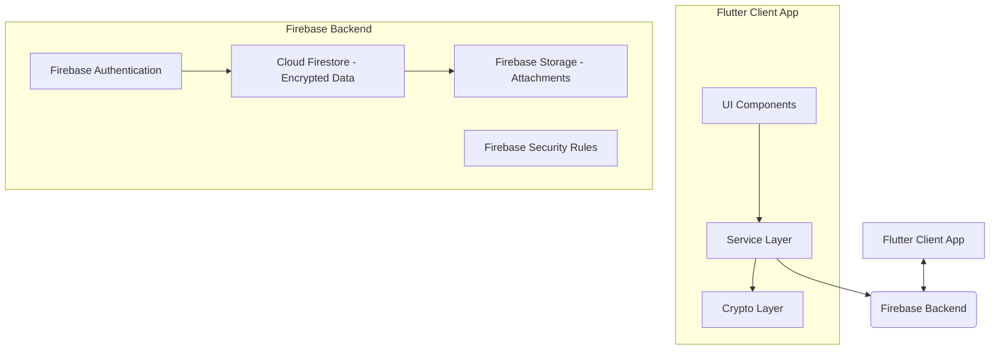

# Chatty - A Secure Messaging Application


**Project for Computer and Network Security Course**  
**École Nationale Supérieure d'Informatique et d'Analyse des Systèmes**  
**Date:** May 14, 2025

## 1. Overview

Chatty is a secure, cross-platform messaging application developed as a project for the Computer and Network Security course. Built with **Flutter** for the frontend and **Firebase** for backend services, Chatty prioritizes user privacy and data security through robust **end-to-end encryption (E2EE)** for both direct and group communications.

The primary goal of Chatty is to provide an intuitive, feature-rich, and secure messaging experience, demonstrating the practical application of modern cryptographic protocols and secure development practices.

## 2. Key Features

Chatty offers a range of features designed for a seamless and secure user experience:

*   **User Management & Authentication:**
    *   Secure email/password-based registration and login.
    *   Unique username system for user identification.
    *   Mandatory email verification for account activation.
    *   Secure password reset functionality.
    *   Profile customization with profile pictures.
*   **Secure Messaging:**
    *   **End-to-End Encrypted** direct (one-to-one) messages.
    *   **End-to-End Encrypted** group messages.
    *   Support for sending text messages and links (with previews).
    *   Real-time message delivery and synchronization.
    *   Message timestamps and typing indicators.
    *   User online status.
*   **User Interface & Experience:**
    *   Clean, modern, and intuitive chat interface.
    *   Responsive design for various screen sizes.
    *   Support for both Light and Dark themes.
    *   Custom-styled chat bubbles for clear message distinction.
    *   User-friendly form validation and error messages.
*   **Group Features:**
    *   Group creation and management.
    *   Admin controls for group settings.
    *   Member management (adding/removing users).
    *   Group profile customization.
*   **Security Focus:**
    *   **End-to-End Encryption (E2EE):** Ensures that only the communicating users can read the messages.
    *   **Secure Key Management:** Private keys are generated and stored securely on the user's device and never leave it.
    *   **Forward Secrecy:** For direct messages, compromising a long-term key does not compromise past session keys.
    *   **Authenticated Encryption:** Provides both confidentiality and integrity for messages.
    *   **Firebase Security Rules:** Enforce data access control and validation at the backend.
    *   **TLS Encryption:** All communication with Firebase services is secured using TLS.

## 3. Technology Stack

Chatty leverages a modern technology stack for robust and efficient development:

*   **Frontend:**
    *   **Flutter:** Cross-platform UI toolkit for building natively compiled applications for mobile, web, and desktop from a single codebase.
    *   **Dart:** Programming language optimized for UI development.
*   **Backend (Firebase):**
    *   **Firebase Authentication:** For secure user sign-up, sign-in, and identity management.
    *   **Cloud Firestore:** NoSQL document database for storing user data, chat metadata, and encrypted messages.
    *   **Firebase Storage:** For storing media attachments (if implemented).
    *   **Firebase Security Rules:** To protect data in Cloud Firestore and Firebase Storage.
*   **Security Libraries & Cryptography:**
    *   **`cryptography` (Dart package):** Provides implementations for cryptographic algorithms.
        *   **X25519:** Elliptic curve Diffie-Hellman for secure key exchange.
        *   **AES-GCM (256-bit):** Authenticated symmetric encryption for message content.
    *   **`flutter_secure_storage`:** For securely storing sensitive data like private keys on the device.

## 4. Security Implementation Highlights

Security is a core tenet of Chatty. Here's how we approach it:

*   **End-to-End Encryption (E2EE) Process:**
    1.  **Key Generation:** Each user generates an X25519 key pair (public and private key) upon registration. The private key is stored securely on the device.
    2.  **Public Key Distribution:** Public keys are shared via Firebase, allowing users to retrieve the public keys of their contacts.
    3.  **Shared Secret Derivation:** For a direct chat, a shared secret is derived using the sender's private key and the recipient's public key (X25519 Diffie-Hellman).
    4.  **Message Encryption:** Messages are encrypted using AES-GCM with a key derived from the shared secret.
    5.  **Group Messaging Encryption:** A unique symmetric key is generated for each group message. This message key is then encrypted for each group member using their individual shared secret with the sender.
*   **Key Management:**
    *   Private keys **never** leave the user's device.
    *   `flutter_secure_storage` is used to protect private keys from unauthorized access.
*   **Data Integrity:** AES-GCM provides authenticated encryption, ensuring that messages are not tampered with during transit.
*   **Server-Side Security:** Firebase Security Rules are configured to ensure that users can only access their own data and relevant chat information. The server (Firebase) never has access to unencrypted message content or private keys.

## 5. Architecture Overview

Chatty follows a client-server architecture:

*   **Flutter Client Application:** Handles all UI rendering, user interactions, client-side logic, and cryptographic operations (encryption/decryption).
*   **Firebase Backend:** Provides services for authentication, real-time database (Firestore for encrypted messages and metadata), and secure data storage.



## 6. Screenshots

*(Placeholder for screenshots of the application - e.g., Login, Chat Interface, Group Chat)*

```
[Login Screen Screenshot]
[Chat Screen Screenshot]
[Group Chat Screenshot]
```

## 7. Getting Started

*(Placeholder for instructions on how to build and run the project)*

### Prerequisites

*   Flutter SDK (Specify version if necessary)
*   Dart SDK
*   Firebase Account & Project Setup
*   ... (any other dependencies)

### Installation & Setup

1.  Clone the repository:
    ```bash
    git clone https://github.com/LyesHADJAR/chatty.git
    cd chatty
    ```
2.  Set up Firebase for your project:
    *   Create a Firebase project at [console.firebase.google.com](https://console.firebase.google.com/).
    *   Add an Android and/or iOS app to your Firebase project.
    *   Download the `google-services.json` (for Android) and/or `GoogleService-Info.plist` (for iOS) configuration files and place them in the appropriate directories (`android/app/` and `ios/Runner/`).
3.  Install Flutter dependencies:
    ```bash
    flutter pub get
    ```
4.  Run the application:
    ```bash
    flutter run
    ```

## 8. Team Members & Instructors

This project was developed by:

*   **Team Members:**
    *   Lyes Hadjar (Team Leader)
    *   Sara Abid
    *   Abderahmane Ainouche
    *   Nour El Houda Elyebdri
    *   Islam Mohamed Eldera Abderrezak
    *   Mohammed El Amine Kichah
*   **Instructors:**
    *   Dr. Karim Lounis (Lecturer)
    *   Yacine Sahraoui (Lab Instructor)

## 9. Future Work

Potential enhancements and future developments for Chatty include:

*   Implement secure key backup and recovery mechanisms.
*   Add support for disappearing messages.
*   Enhance metadata protection (e.g., minimizing what the server knows about communication patterns).
*   Implement key verification mechanisms (e.g., safety numbers or QR code scanning) to protect against man-in-the-middle attacks on key exchange.
*   Support for secure multi-device usage.
*   Optimize performance for very large group chats.
*   Implement more advanced group key management protocols (e.g., ratcheting for groups).
*   Add secure voice and video calling capabilities.
*   Support for sending encrypted media attachments (images, videos, files).

## 10. Contributing

*(Placeholder: If you wish to allow contributions, outline the process here. For a course project, this might be minimal or state that contributions are not currently accepted.)*

We welcome contributions! Please follow these steps:
1. Fork the repository.
2. Create a new branch (`git checkout -b feature/your-feature-name`).
3. Make your changes.
4. Commit your changes (`git commit -am 'Add some feature'`).
5. Push to the branch (`git push origin feature/your-feature-name`).
6. Create a new Pull Request.

## 11. License

*(Placeholder: Choose an appropriate open-source license if applicable, e.g., MIT, Apache 2.0. For a university project, you might state that it's for educational purposes.)*

This project is licensed under the [MIT License](LICENSE.md) - see the LICENSE.md file for details.

---